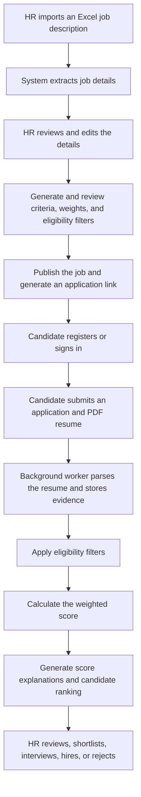
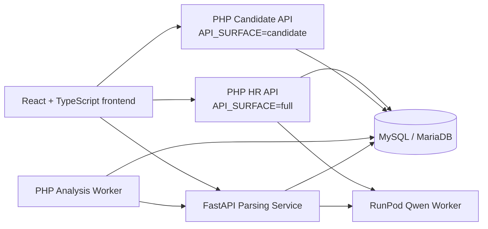

# AI-Based Human Resource Decision Support System

An AI-assisted human resource decision support system developed for UWC Berhad. The project brings job creation, candidate applications, resume parsing, eligibility screening, weighted scoring, candidate ranking, and recruitment communication into one platform so HR teams can screen applicants more efficiently and transparently.

> This system provides decision support only. It does not automatically hire or reject candidates. Final recruitment decisions remain with authorized HR staff and hiring managers.

## Table of contents

- [Project goals](#project-goals)
- [Core features](#core-features)
- [Users and access](#users-and-access)
- [Recruitment workflow](#recruitment-workflow)
- [System architecture](#system-architecture)
- [Technology stack](#technology-stack)
- [Repository structure](#repository-structure)
- [Local development](#local-development)
- [Environment variables](#environment-variables)
- [Testing and verification](#testing-and-verification)
- [Deployment](#deployment)
- [Current limitations](#current-limitations)
- [Decision support principles](#decision-support-principles)
- [Project information](#project-information)
- [Licensing](#licensing)

## Project goals

Traditional resume screening can be time-consuming, inconsistent, and difficult to explain. This project improves the recruitment workflow by:

- Converting unstructured job descriptions and resumes into reviewable structured data.
- Allowing HR to define screening criteria, weights, and mandatory eligibility requirements.
- Preserving resume evidence, matched requirements, missing requirements, and weighted contributions for every score.
- Keeping eligibility screening separate from weighted scoring so the two rule sets remain clear.
- Recording candidate statuses, HR actions, emails, and analysis results for traceability.
- Using models for extraction and assisted interpretation while deterministic rules perform validation, constraints, and final score calculation.

## Core features

### HR staff and hiring managers

- Internal login and role-based interface access.
- Recruitment dashboard, job management, and department views.
- Import Excel job descriptions and select a worksheet for data extraction.
- Review job details, AI-suggested criteria, eligibility filters, and scoring weights.
- Publish jobs and generate unique application links.
- View candidate lists, rankings, eligibility results, and criterion-level score explanations.
- Perform Reviewed, Shortlisted, Interview, Interviewed, Hired, Rejected, and Filtered Out workflow actions.
- Send interview or rejection emails and manage templates, attachments, notifications, and action logs.
- Manage internal users, profiles, settings, reports, and HR efficiency analytics.

### Candidate Career Portal

- Browse public job openings and job details.
- Register, sign in, and maintain a candidate profile.
- Apply through a job-specific link and upload a PDF resume.
- View application history, analysis progress, and recruitment status.
- Withdraw an application and submit an Employment Form when entering the hiring process.

### AI and decision support

- Extract job title, department, responsibilities, qualifications, and requirements from a job description worksheet.
- Generate job-specific scoring criteria for HR review and editing.
- Parse text-layer PDF resumes while preserving source evidence.
- Use Qwen for constrained semantic enrichment and reject claims that are unsupported by source evidence.
- Run mandatory eligibility screening separately from weighted candidate scoring.
- Return criterion-level scores, matched evidence, eligibility reasons, weighted totals, and ranking readiness.
- Process application analysis through a background worker and retry eligible transient failures once.

Eligibility results and recruitment decisions are separate concepts. An `eligibility_status` of `filtered_out` means that a candidate did not meet a mandatory condition configured by HR and is therefore excluded from the normal ranking. It is a reviewable decision-support result, not a final HR rejection. Final workflow decisions are recorded in `application_status`.

## Users and access

| User | Current access |
| --- | --- |
| HR Staff | Dashboard, jobs, applications, candidate review, interview and rejection workflows, notifications, and personal settings |
| Hiring Manager | All HR Staff pages, plus user management and HR efficiency analytics |
| Candidate | Public jobs, registration and login, profile, applications, application history, and Employment Form |

The system does not currently have a separate Admin role. Hiring Manager is the role that can manage internal users. Internal HR permissions are currently enforced mainly through frontend routing; production use requires server-side sessions and route-level authorization to be strengthened.

## Recruitment workflow



## System architecture



The system contains the following main components:

1. **React frontend** — the same codebase can build either the full HR interface or a candidate-only interface.
2. **PHP REST API** — the same source is deployed with `full` and `candidate` surfaces to handle authentication, jobs, applications, emails, notifications, and workflow data.
3. **PHP Analysis Worker** — claims pending applications from the database and calls the Parsing Service.
4. **FastAPI Parsing Service** — handles browser-to-service job description requests and worker-initiated resume parsing and candidate scoring.
5. **RunPod Qwen Worker** — provides job criteria generation, resume semantic understanding, and semantic candidate scoring.
6. **MySQL/MariaDB** — stores business data, parsed profiles, score breakdowns, and audit records.

`API_SURFACE=candidate` rejects HR-only routes at the server boundary instead of relying only on hidden frontend pages.

## Technology stack

| Layer | Technologies |
| --- | --- |
| Frontend | React 19, TypeScript 5.8, Vite 6, Tailwind CSS 4, Radix UI, React Router, Recharts |
| Core API | PHP 8.2+, MySQLi, Apache/XAMPP |
| Parsing and scoring | Python, FastAPI, Pydantic, PyMuPDF, pypdf, openpyxl |
| AI inference | Qwen2.5-3B-Instruct, Transformers, PyTorch, RunPod Serverless |
| Database | MySQL / MariaDB |
| Deployment | Docker, Railway, RunPod |
| Testing | TypeScript build, Node contract tests, PHP contract tests, Pytest |

## Repository structure

```text
HR System/
├── app/                  React pages, components, routes, and API client
├── styles/               Global styles
├── server/               PHP REST API, analysis worker, and email handling
├── parsing-service/      FastAPI service for JD Excel, resume parsing, and scoring
├── llm_criteria_api/     Qwen inference, evidence constraints, and RunPod worker
├── database/             Base schema, sample data, and incremental migrations
├── deploy/railway/       Docker and Railway deployment files
├── tools/                Local validation and diagnostic scripts
├── project-docs/         Project progress, decisions, bug log, and handover notes
├── package.json          Frontend dependencies and scripts
└── README.md             Repository entry documentation
```

Detailed service documentation:

- [Parsing Service](parsing-service/README.md)
- [JD Criteria / RunPod Service](llm_criteria_api/README.md)
- [Database](database/README.md)
- [Railway Deployment](deploy/railway/README.md)
- [Project Memory](project-docs/README.md)

## Local development

The following steps use Windows PowerShell, XAMPP, and a local database.

### 1. Prerequisites

- Node.js 20 or later
- npm
- PHP 8.2 or later with `mysqli`, `curl`, and `openssl` enabled
- MySQL 8 or MariaDB, including the MySQL installation bundled with XAMPP
- Python 3.11 or later
- Optional: access to a RunPod endpoint hosting the Qwen worker for the complete AI workflow

### 2. Install frontend dependencies

```powershell
npm ci
```

### 3. Initialize the local database

Start XAMPP MySQL, then import the base schema:

```powershell
Get-Content -LiteralPath database\schema.sql |
  & C:\xampp\mysql\bin\mysql.exe -u root
```

To add more sample data, import the optional seed files:

```powershell
Get-Content -LiteralPath database\seed-demo.sql |
  & C:\xampp\mysql\bin\mysql.exe -u root uwc_hr_decision_support

Get-Content -LiteralPath database\seed-more.sql |
  & C:\xampp\mysql\bin\mysql.exe -u root uwc_hr_decision_support
```

`database/schema.sql` is the complete baseline for a new installation. Files under `database/migrations/` upgrade an existing database; do not automatically reapply every migration to a newly created database.

The base schema includes two internal demo users:

| Role | Email |
| --- | --- |
| HR Staff | `hr@uwc.com.my` |
| Hiring Manager | `manager@uwc.com.my` |

Internal HR login verifies the submitted password against the user's `password_hash`. The baseline demo accounts use `username123@`; production accounts should use unique passwords and the user-management reset flow.

### 4. Configure the PHP API

Copy the environment template:

```powershell
Copy-Item server\.env.local.example server\.env.local
```

Replace the relevant local settings in `server/.env.local` with the following configuration:

```dotenv
DB_HOST=127.0.0.1
DB_PORT=3306
DB_USER=root
DB_PASSWORD=
DB_NAME=uwc_hr_decision_support
DB_SSL_VERIFY=false

API_SURFACE=full
CORS_ORIGINS=http://localhost:5173,http://127.0.0.1:5173
PUBLIC_API_BASE_URL=http://127.0.0.1:8080

RUNPOD_CRITERIA_ENDPOINT_URL=
RUNPOD_API_KEY=
RESUME_PARSING_API_URL=http://127.0.0.1:8001/api/resume/parse
RESUME_REQUIRE_SEMANTIC=false
CANDIDATE_SCORING_API_URL=http://127.0.0.1:8001/api/scoring/candidate
```

Do not commit `server/.env.local`, API keys, database passwords, or email credentials.

Start the API directly from the source directory with XAMPP PHP:

```powershell
& C:\xampp\php\php.exe -S 127.0.0.1:8080 -t server
```

Health check: `http://127.0.0.1:8080/api.php?route=health`

### 5. Start the FastAPI Parsing Service

Open a new PowerShell window and run:

```powershell
cd parsing-service
python -m venv .venv
.\.venv\Scripts\python.exe -m pip install -r requirements.txt
$env:DB_HOST = "127.0.0.1"
$env:DB_PORT = "3306"
$env:DB_USER = "root"
$env:DB_PASSWORD = ""
$env:DB_NAME = "uwc_hr_decision_support"
```

This configuration is sufficient for development without RunPod or Qwen. In this mode, you can develop and verify the frontend, internal login, job management, Candidate Portal, application persistence, JD Excel extraction, and the local rule-based JD criteria fallback. Complete semantic candidate scoring will not succeed.

To run the complete AI workflow, set the following variables in the same PowerShell window before starting Uvicorn:

```powershell
$env:RESUME_QWEN_PROTOCOL = "runpod"
$env:CANDIDATE_QWEN_PROTOCOL = "runpod"
$env:RUNPOD_CRITERIA_ENDPOINT_URL = "https://api.runpod.ai/v2/<endpoint-id>/runsync"
$env:RUNPOD_API_KEY = "<secret>"
```

Also replace `RUNPOD_CRITERIA_ENDPOINT_URL` and `RUNPOD_API_KEY` in `server/.env.local` with the same real values and set `RESUME_REQUIRE_SEMANTIC=true`. Restart the PHP API if it is already running.

After preparing the selected mode, start Uvicorn in the current Parsing Service window:

```powershell
.\.venv\Scripts\python.exe -m uvicorn app.main:app --reload --port 8001
```

Available endpoints:

- Health: `http://127.0.0.1:8001/health`
- Swagger UI: `http://127.0.0.1:8001/docs`

### 6. Configure and start the frontend

Create `.env.local` in the repository root:

```dotenv
VITE_HR_API_BASE_URL=http://127.0.0.1:8080/api.php
VITE_CANDIDATE_API_BASE_URL=http://127.0.0.1:8080/api.php
VITE_JD_PARSING_API_URL=http://127.0.0.1:8001
```

Start Vite:

```powershell
npm run dev
```

Default address: `http://localhost:5173`

### 7. Start the candidate analysis worker for the complete AI mode

`application_analysis_worker.php` performs one processing cycle and then exits. To keep processing new local applications, run the following polling loop in another PowerShell window:

```powershell
while ($true) {
  & C:\xampp\php\php.exe server\application_analysis_worker.php --once
  Start-Sleep -Seconds 2
}
```

Press `Ctrl+C` to stop the worker. To process at most one currently queued application, run the PHP command once without the loop.

## Environment variables

### Frontend

| Variable | Purpose | Default |
| --- | --- | --- |
| `VITE_HR_API_BASE_URL` | Full HR API address | `http://localhost/uwc-hr-api/api.php` |
| `VITE_CANDIDATE_API_BASE_URL` | Candidate API address | Deployed Candidate API address included in the project |
| `VITE_API_BASE_URL` | Shared API address for a candidate-only build | None |
| `VITE_APP_SURFACE` | Use `candidate` to build the public candidate interface | Full interface |
| `VITE_JD_PARSING_API_URL` | Job description worksheet parsing service | `http://127.0.0.1:8001` |
| `VITE_JD_CRITERIA_API_URL` | Retained standalone JD criteria/diagnostic endpoint; not required by the current Create Job flow | `http://127.0.0.1:8002` |

### PHP API and Parsing Service

See the following files for the complete variable reference:

- [`server/.env.local.example`](server/.env.local.example)
- [`parsing-service/README.md`](parsing-service/README.md)
- [`llm_criteria_api/README.md`](llm_criteria_api/README.md)

Common settings cover the database connection, CORS, public API address, email provider, RunPod endpoint, resume parser address, candidate scoring address, and request timeouts. Production secrets must be injected through the deployment platform's secret management system.

## Testing and verification

### Frontend and shared logic

```powershell
npm run build
npm run test:jd-criteria-fallback
npm run test:candidates
```

### Parsing Service

```powershell
cd parsing-service
.\.venv\Scripts\python.exe -m pytest
```

### JD Criteria / Qwen Service

```powershell
cd llm_criteria_api
python -m venv .venv
.\.venv\Scripts\python.exe -m pip install -r requirements.txt
$env:MOCK_LLM = "true"
.\.venv\Scripts\python.exe -m pytest -q
```

### PHP API

PHP contract tests are stored under `server/tests/`. For example:

```powershell
npm run test:deployment-config
& C:\xampp\php\php.exe server\tests\application_analysis_contract_test.php
& C:\xampp\php\php.exe server\tests\asynchronous_analysis_contract_test.php
```

## Deployment

The current deployment design uses the following services:

1. Railway MySQL
2. Railway `candidate-api`
3. Railway `hr-api`
4. Railway `parsing-service`
5. Railway `candidate-web`
6. RunPod Serverless Qwen worker

The Candidate API uses `API_SURFACE=candidate`, while the HR API uses `API_SURFACE=full`. Candidate Web is built with `VITE_APP_SURFACE=candidate`, so it contains only public recruitment and candidate routes.

## Current limitations

- Job description import currently uses `.xlsx` workbooks.
- Candidate resumes must be PDFs, and the current parser requires a readable text layer.
- OCR is not enabled for image-only or scanned resumes; these files return a clear extraction error.
- Parsing and semantic quality depend on file quality, document layout, and model availability.
- Scores depend on the criteria, weights, and eligibility filters reviewed and saved by HR.
- The system is an advanced academic prototype, not a complete commercial applicant tracking system.
- Internal HR authentication still requires server-side session and authorization hardening before production use.
- Production use also requires environment-specific security review, authorization testing, backups, monitoring, and formal accuracy evaluation.

## Decision support principles

The system can:

- Extract and structure information.
- Apply HR-defined rules.
- Calculate and explain scores.
- Rank candidates who are eligible for ranking.
- Preserve evidence and audit information.
- Support human review.

The system does not:

- Automatically hire a candidate.
- Make a final rejection decision without HR action.
- Replace professional recruitment judgment with model output.

## Project information

| Item | Details |
| --- | --- |
| Project | AI-Based Human Resource Decision Support System |
| Type | Final Year Project |
| Industry partner | UWC Berhad |
| Programme | Bachelor of Computer Science |
| Institution | University of Wollongong Malaysia Penang |
| Supervisor | Dr. Wong Khang Siang |

Project progress, architecture decisions, bug records, and handover information are maintained under [`project-docs/`](project-docs/README.md).

## Licensing

This repository is intended for academic and educational use and does not currently include a standard open-source license. Unless the project owner grants explicit permission, the project content, data, and source code may not be used commercially, redistributed, or used to create derivative projects.
